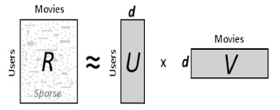
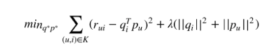
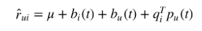
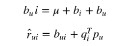
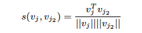

# Project 4: Algorithm implementation and evaluation: Collaborative Filtering

### [Project Description](doc/project4_desc.md)

Term: Fall 2019

+ Team # 1
+ Projec title: Comparing the effect of regularizations

+ Team members
	+ Gao, Zun
	+ Zhang, Qingyu
	+ Zhao, Marshall
	+ Zhou, Zian
	
+ Project summary: The purpose of the project is to evaluate effects of regularizations for the recommender system. 
Controlling Stochastic Gradient Descent Factorization Method and KNN Post-Processing, we compare the regularization terms in three cases, 1) Baseline No Regularization Terms 2) Penalty of Magnitudes and 3) Bias and Intercepts + Temporal Dynamics. 

+ What is Matrix Factorizaition Techniques? (see doc/paper/P1 Recommender-Systems.pdf)
	
	Matrix factorization characterizes both items and users by vectors of factors inferred from item rating patterns.


	+ Steps: 
		+ Step 1: Convert Data into **R** matrix 
	
		+ Step 2: Use the Stochastic Gradient Descent algorithm (with regularization term) to train the data and get **U** AND **V** 
		
		
			+ Case 1: No Regularization Term
		
			+ Case 2: Apply Regularization Term **Temporal Dynamics** to the algorithm
			
			**Temporal Dynamics** (see doc/paper/P5 Collaborative Filtering with Temporal Dynamics.pdf): 
			
			The presented models have been static. In reality, product perception and popularity constantly change as new selections emerge. Similarly, customers’ inclinations evolve, leading them to redefine their taste. Thus, the system should account for the temporal effects reflecting the dynamic, time-drifting nature of user-item interactions.
			
			
		
			+ Case 3: Apply Regularization Term **Bias and Intercepts + Penalty of Magnitudes** to the algorithm
			
			**Penalty of Magnitudes** (see doc/paper/P1 Recommender-Systems.pdf) :
			
			
					
			**Bias and Intercepts** :
			
			The observed variation in rating values is due to effects associated with either users or items, known as biases or intercepts, independent of any interactions.
			
			
			
			The bias involved in rating r<sub>ui</sub> is denoted by b<sub>ui</sub> and accounts for the user and item effects. 
					
+ Post-processing with KNN (see doc/c/P2 Recommender-Systems.pdf)

	+ Steps: 
	
		+ Step 1: Define similarity between movies *j* and *j2* as cosine similarity between vectors *vj* and *vj2* obtained from regularized SVD:
		
		
	
		+ Step 2: We use prediction by k nearest neighbor using similarity s and refer to this method as ”SVD KNN. In this case, we chose one nearest neighbor. 

+ Result

| Pairings      | Test RMSE  | Best Parameters |
| ------------- |:-------------:| ------------:|
| SGD      |   2.66   | F = 10, lambda = 0.1  |
| SGD + Temporal Dynamics | | 2.71    | F = 10, lambda = 0.1   |
| SGD + Penalty of Magnitudes + Bias and Intercepts | 2.80 | F = 10, lambda = 0.1  |

| Pairings      | Test RMSE  | Best Parameters |
| ------------- |:-------------:| -----:|-----:|
| SGD + KNN     |   1.08    | F = 10, lambda = 0.1  |
| SGD + Temporal Dynamics + KNN| | 2.80     | F = 10, lambda = 0.1   |
| SGD + Penalty of Magnitudes + Bias and Intercepts + KNN|1.28 | F = 10, lambda = 0.1  |

	+ In most cases, KNN Post-processing improves the result.
	+ Adding regularization terms does not improve the result. 
		

+ Dataset: [MovieLens](http://movielens.org) (see data/ml-latest-small)
	
**Contribution statement**: 
+ The team members contribute equally.
+ All team members approve our work presented in this GitHub repository including this contributions statement. 

Following [suggestions](http://nicercode.github.io/blog/2013-04-05-projects/) by [RICH FITZJOHN](http://nicercode.github.io/about/#Team) (@richfitz). This folder is orgarnized as follows.

```
proj/
├── lib/
├── data/
├── doc/
├── figs/
└── output/
```

Please see each subfolder for a README file.
